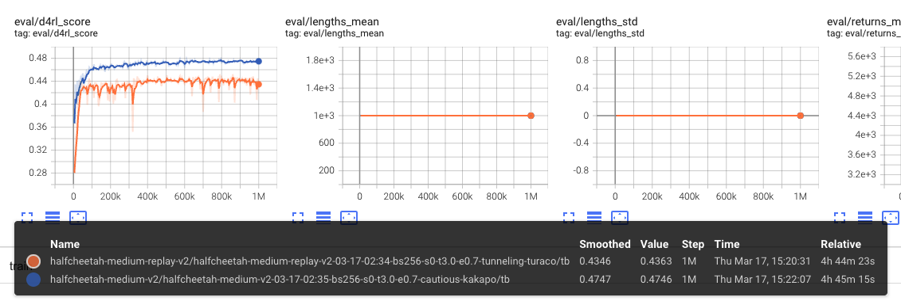
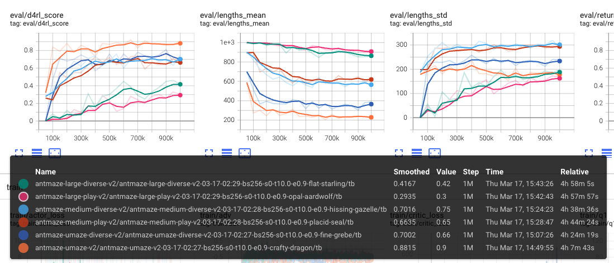

# IQL Implementation in PyTorch

## IQL

This repo is an unofficial implementation of In-sample Q-Learning (Implicit Q-Learning) in PyTorch.

```
@inproceedings{
    kostrikov2022offline,
    title={Offline Reinforcement Learning with In-sample Q-Learning},
    author={Ilya Kostrikov and Ashvin Nair and Sergey Levine},
    booktitle={International Conference on Learning Representations},
    year={2022},
    url={https://openreview.net/forum?id=68n2s9ZJWF8}
}
```

## Train

### Gym-MuJoCo

```
python main_iql.py --env halfcheetah-medium-v2 --expectile 0.7 --temperature 3.0 --eval_freq 5000 --eval_episodes 10 --normalize
```

### AntMaze

```
python main_iql.py --env antmaze-medium-play-v2 --expectile 0.9 --temperature 10.0 --eval_freq 50000 --eval_episodes 100
```

## Results





## Acknowledgement

This repo borrows heavily from [sfujim/TD3_BC](https://github.com/sfujim/TD3_BC) and [ikostrikov/implicit_q_learning](https://github.com/ikostrikov/implicit_q_learning).